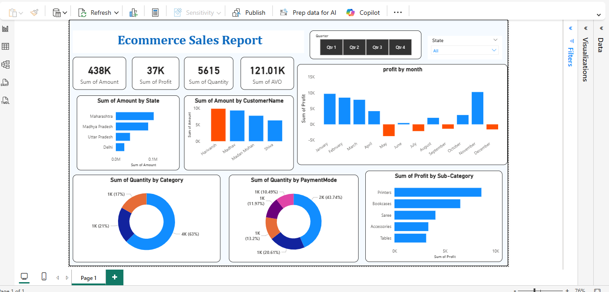
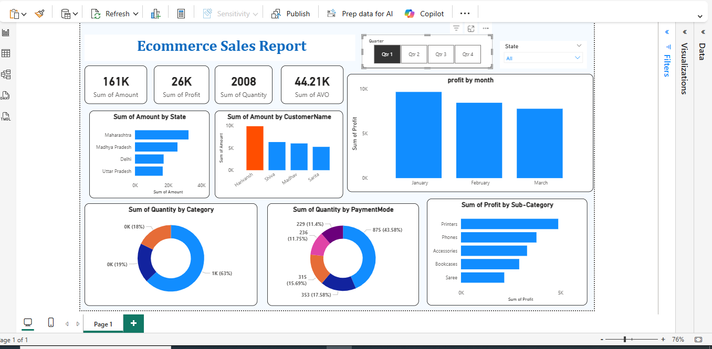
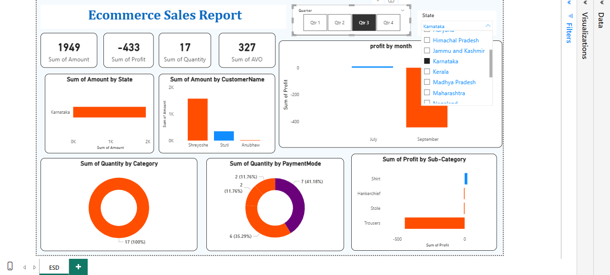

# 🛒 Ecommerce Sales Dashboard (Power BI)

## 📊 Project Overview

The **Ecommerce Sales Dashboard** provides a comprehensive analysis of online sales performance using interactive visualizations. The dashboard helps businesses monitor revenue, profit, quantity sold, and customer purchasing behavior across different states, categories, and time periods.

This project enables business stakeholders to quickly understand sales trends and make **data-driven decisions to improve business performance**.

---

# 🧩 Problem Statement

Ecommerce businesses generate large amounts of sales data every day. Without proper analysis, it becomes difficult to track sales performance, identify profitable products, and understand customer purchasing behavior.

The objective of this project is to build an **interactive Power BI dashboard** that provides insights into sales performance, customer trends, and product profitability.

---

# 🎯 Project Objectives

* Analyze overall ecommerce sales performance
* Track **total sales amount, profit, and quantity sold**
* Identify **top-performing states and customers**
* Analyze **profit trends by month**
* Evaluate **product category performance**
* Understand **payment mode preferences**
* Identify **high-profit product sub-categories**

---

# 📂 Dataset Description

The dataset contains ecommerce transaction data including information about:

* Order Amount
* Profit
* Quantity Sold
* Customer Name
* State
* Product Category
* Product Sub-Category
* Payment Mode
* Order Date

This data is used to generate meaningful insights and visualizations within the dashboard.

---

# 📈 Key Performance Indicators (KPIs)

* **Total Sales Amount:** 438K
* **Total Profit:** 37K
* **Total Quantity Sold:** 5615
* **Average Sales Value:** 121.01K

These KPIs help track overall ecommerce business performance.

---

# 📊 Dashboard Insights

### Sales by State

The dashboard shows which states generate the highest sales revenue.

Top contributing states include:

* Maharashtra
* Madhya Pradesh
* Uttar Pradesh
* Delhi

---

### Top Customers by Sales

The dashboard identifies customers generating the highest purchase value.

This helps businesses understand **key customers contributing to revenue**.

---

### Monthly Profit Analysis

The **profit by month** visualization highlights profit fluctuations throughout the year and identifies months with high or low profitability.

---

### Quantity Sold by Category

Product categories are analyzed to understand which category sells the most.

This helps businesses **focus on high-demand product segments**.

---

### Payment Mode Analysis

The dashboard visualizes how customers prefer to pay, such as:

* Cash on Delivery
* Credit Card
* Debit Card
* Online Payment

This helps businesses optimize payment options for customers.

---

### Profit by Sub-Category

Sub-category analysis identifies products that generate the highest profit.

Examples include:

* Printers
* Bookcases
* Saree
* Accessories
* Tables

---

# 🛠 Tools & Technologies Used

* **Power BI**
* **Power Query**
* **Data Modeling**
* **Data Visualization**
* **Business Intelligence Techniques**

---

# 💡 Business Value

This dashboard helps ecommerce businesses:

* Monitor overall sales performance
* Identify profitable products and categories
* Understand customer purchasing behavior
* Track monthly profit trends
* Analyze regional sales performance
* Support strategic business decisions

---

# 📷 Dashboard Preview

---

# 🚀 Future Improvements

Possible enhancements include:

* Customer segmentation analysis
* Product recommendation insights
* Predictive sales forecasting
* Integration with real-time ecommerce data

---

# 👩‍💻 Author

**Anjali Havanur**

If you found this project helpful, consider ⭐ starring the repository.
